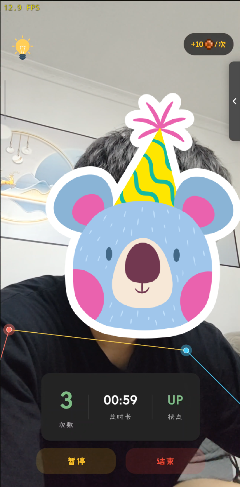
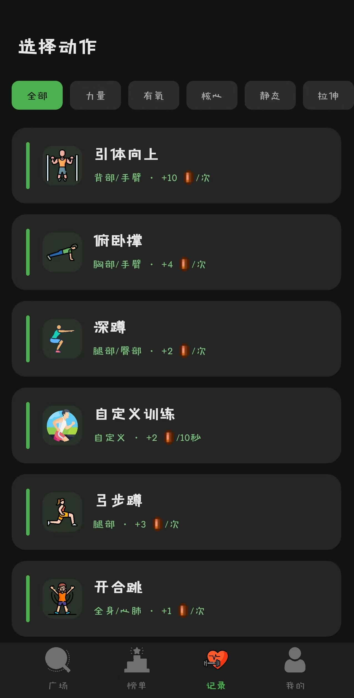
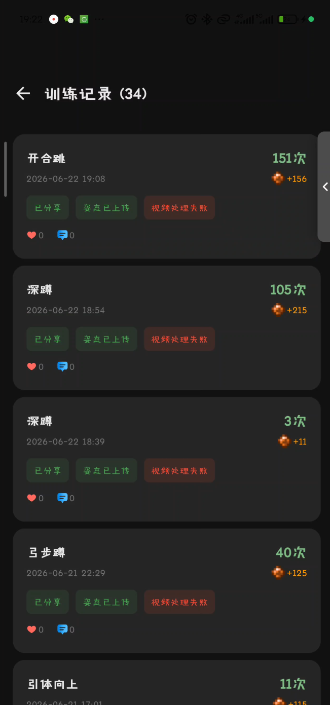
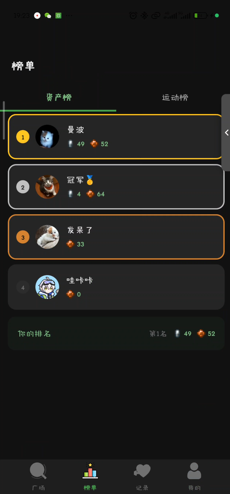
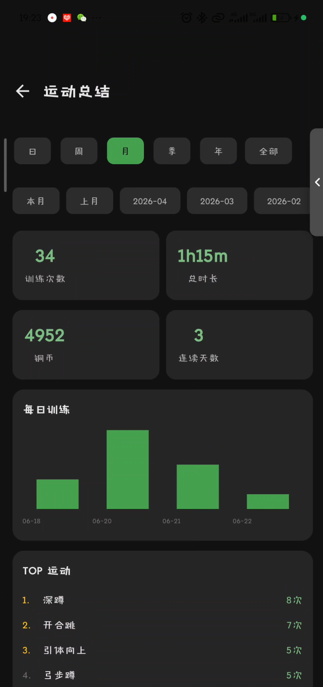
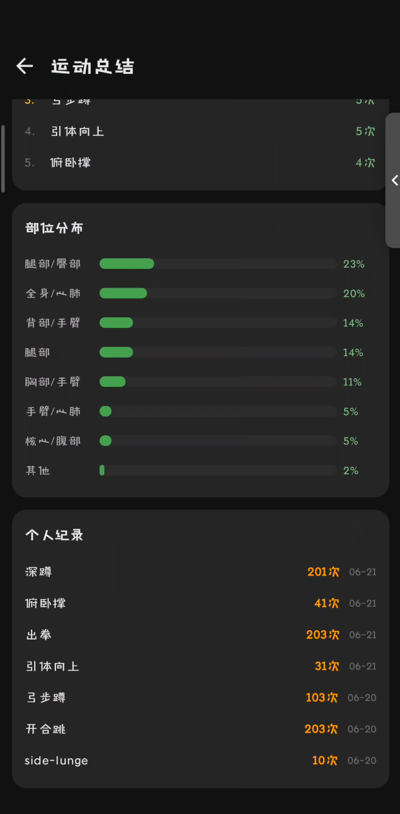
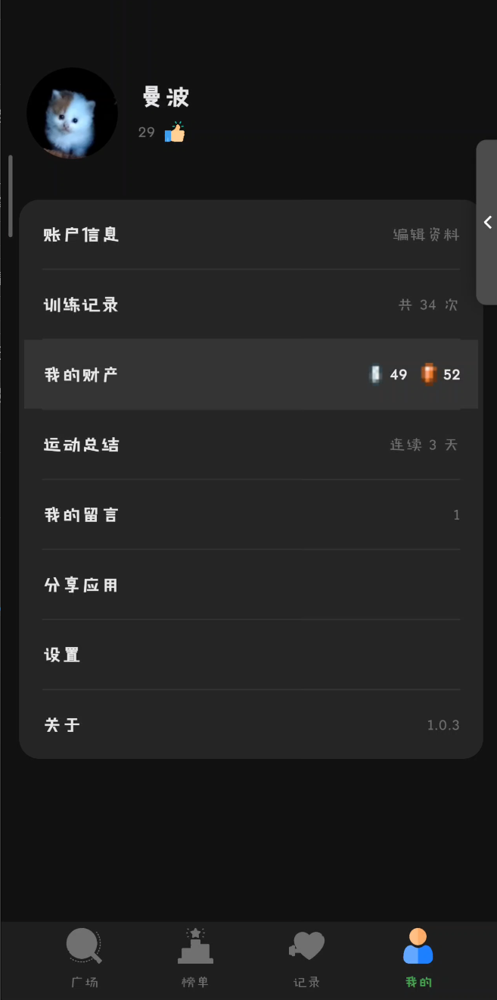

# KeepUp — 你的 AI 健身裁判 📱

<p align="center">
  <b>手机架好，摄像头对准，剩下的交给 KeepUp。</b><br>
  不需要手表 · 不需要手环 · 一部手机就能精准计次
</p>

<p align="center">
  <a href="README.md">English</a>
  &nbsp;·&nbsp;
  <a href="http://123.56.229.196:18443/keepup"><b>👉 点我下载 KeepUp 👈</b></a>
  &nbsp;·&nbsp;
  <a href="https://github.com/jumppppp/KeepUP">GitHub</a>
</p>

---

## 🆕 v1.1.0 — 更智能、更快、更精准

**AI 智能检测**：不用手动选运动，打开摄像头直接开练——KeepUp 自动识别你在做什么。一次训练可批量检测多种运动，每个条目独立生成骨架回放视频。

**14 种新检测规则**：绝对值、距离、角度、中点、三角函数——运动追踪比以往任何时候都精准。平板支撑塌腰、侧弓步等新运动现在都能检测。

**三层防误检过滤**：不再出现站着不动也检测出深蹲。置信度颜色直观显示 AI 的判断把握：🟢 ≥90% · 🟡 ≥75% · 🔴 以下。

> [完整更新日志](https://github.com/jumppppp/KeepUP/releases)

---

## 🤖 它是怎么盯着你的？

你练你的，手机摄像头开着就行。KeepUp 内置 AI 姿态识别引擎，实时追踪你身体的 **33 个骨骼关键点**，精准判断每一个动作是否到位。

- 深蹲有没有蹲到平行？它知道。
- 引体下巴有没有过杠？它清楚。
- 平板支撑有没有偷偷塌腰？它看在眼里。

**🧠 AI 智能检测**：打开摄像头直接开练，KeepUp 自动识别深蹲、俯卧撑、弓步蹲……一次训练批量检测多种运动，每个运动独立生成回放。

> 比健身房教练严格，比女朋友敏锐，比你妈还操心你的姿势。

<p align="center"> &nbsp; </p>

---

## 🎯 39 种运动，一周不重样

不管你是撸铁猛男、帕梅拉女孩、还是"坐太久腰疼所以随便拉伸一下"选手：

| 分类 | 运动 |
|------|------|
| 🔨 力量 (12) | 引体向上、俯卧撑、深蹲、弓步蹲、倒立俯卧撑、肩推、哑铃弯举、臂屈伸、臀桥、侧平举、出拳、动态射箭 |
| 🔥 有氧 (5) | 波比跳、开合跳、高抬腿、登山跑、收腹跳 |
| 🧊 静态 (5) | 平板支撑、靠墙静蹲、空心支撑、倒立保持、射箭保持 |
| 🏋️ 核心 (3) | 卷腹、俄罗斯转体、仰卧抬腿 |
| 🧘 拉伸 (13) | 猫牛脊柱活动、婴儿式放松拉伸、眼镜蛇式伸展、靠墙天使、颈部侧屈拉伸、交叉抱肩后束拉伸、过头肱三头肌拉伸、背后扣手扩胸拉伸、门框胸大肌拉伸、站姿腘绳肌拉伸、靠墙小腿拉伸、弓步髂腰肌拉伸、反向北欧挺 |
| ✏️ 自定义 (1) | 自定义训练——自己做啥填啥，我们不问 |

> 6 大分类 39 种运动。周一引体，周二深蹲，周三波比跳到怀疑人生，周四拉伸治愈——KeepUp 不强制，但你的好友会因为你连续 3 天没动态而来"关心"你。

---

## 🪙 练得越狠，赚得越多

KeepUp 有一套完整的经济系统：

```
🥉 青铜 → 🥈 白银 → 🥇 黄金 → 💎 铂金
  100铜 = 1银 → 100银 = 1金 → 100金 = 1铂金
```

怎么赚？练就完了：

- 引体向上 1 次 = **10 铜**（最难动作，顶级回报）
- 波比跳 1 次 = **7 铜**（心率炸裂，应得的）
- 平板支撑 10 秒 = **5 铜**（耐力活，细水长流）
- 拉伸 10 秒 = **1 铜**（放松性质，别想着靠这发财）

> 公平原则：难度越高，回报越厚。想躺着拉伸刷成铂金？你得拉到下辈子。

<p align="center"></p>

---

## 👀 偷偷看好友练没练

这是 KeepUp 的灵魂功能——**社交压力**：

- **🏟️ 广场**：练完晒记录，配感受、配照片。"今日 100 俯卧撑 ✅"——装 X 是健身的第一生产力。
- **🏆 排行榜**：全站财富榜 + 单项运动榜。支持按性别筛选——"她今天引体比我多了？今晚加练。"
- **👤 个人主页**：点进好友头像，TA 的训练次数、签名、动态全暴露。"说好的今天一起练，你怎么没动静？"
- **💬 留言**：私信催练："已经 3 天没看到你打卡了 👀"

> 一天不练，自己知道；两天不练，KeepUp 好友知道；三天不练——你的留言箱会爆炸。

<p align="center"> &nbsp; </p>

---

## 📊 运动总结：你的年度健身账单

日 / 周 / 月 / 季 / 年，随时翻旧账：

- 🗓 **连续训练天数**：断了就归零，比游戏签到还严格
- 📈 **训练量柱状图**：哪天摸鱼一目了然
- 🏅 **各运动累计排行**：你对引体向上是真爱还是浅尝
- 💪 **身体部位分布**：练胸不练腿？图里藏不住
- 🥇 **个人纪录**：你某年某月某日，引体向上最多做了 15 个——历史会记住
- 💰 **总资产曲线**：赚了多少铜币，花在哪儿了（虽然目前只能赚不能花）

> 年底翻出来看看："哦，原来我 3 月 12 号练过一次。"——也是一种成就。

<p align="center"></p>

---

## 🎬 训练回放：你的骨架动画大片

需要摄像头的运动，KeepUp 会自动录制**骨架动画视频**。

不是普通录屏——是把你每个关节的运动轨迹画出来的火柴人动画。动作哪里变形、哪里偷懒了，回放里看得清清楚楚。

> 发到朋友圈配一句"今日打卡"，比 45° 角对镜自拍高级一个次元。

---

## 💰 我的资产：你的健身银行

<p align="center"></p>

资产主页一目了然：
- 💎🥇🥈🥉 四层货币，直观展示
- 累计训练次数（你有多努力，数字说了算）
- 连续训练天数（断了就没了，珍惜吧）
- 快捷入口：训练记录 / 运动总结 / 留言消息

---

## 🔐 你的数据你说了算

- 全链路 AES-256 加密，别人截到也是乱码
- 不想分享的训练？设为私密，只有自己能看到
- 管理员都看不了你的聊天记录（虽然你也没跟人聊啥）

---

## 🚀 更新日志——不糊弄

每次更新 App 内都会弹提示，告诉你具体改了什么：

> ❌ "修复了一些已知问题"
> ✅ "AI 智能检测三层过滤，不动不再误检"
> ✅ "14 种新检测规则，运动追踪更精准"
> ✅ "开合跳不再跳一次计两次了"

我们承诺：永远不用"修复了一些已知问题"糊弄你。

---

<p align="center">
  <b>KeepUp —— 练了就是练了，没练别想糊弄。🏋️</b><br><br>
  <a href="http://123.56.229.196:18443/keepup">📥 下载 KeepUp</a>
  &nbsp;·&nbsp;
  <a href="https://github.com/jumppppp/KeepUP">⭐ GitHub 加星</a>
</p>
